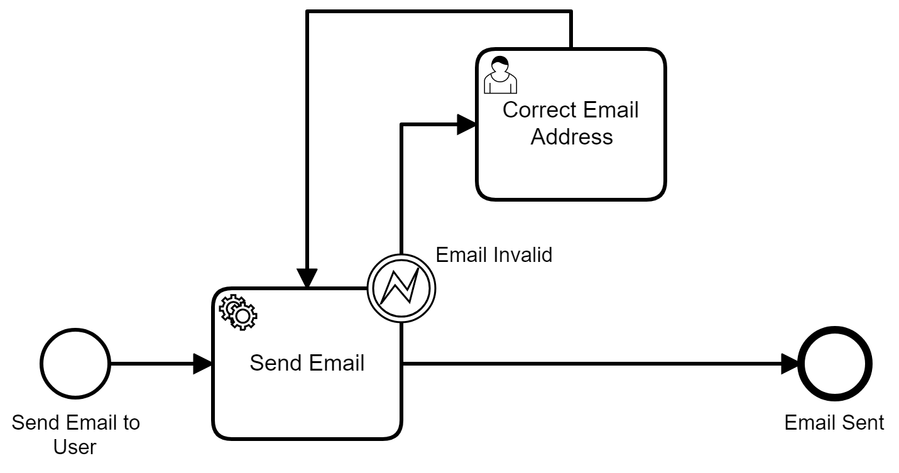

# Send Email External Task Example

This example shows how an External Task can connect to Camunda and send an email when a process reaches a service task with the `SendEmail` Topic

## Running the Project
Running the project has 3 pretty simple steps
1. Download and Run Camunda
1. Configure and Startup The Worker
1. Deploy the Send Email Process

Below I'll describe each step in detail if you aren't already aware of how Camunda projects generally work. 

### **Download and Run Camunda**

Simply go to the [Camunda.com and download](https://camunda.com/download/) the latest version of Camunda Run. 

Unzip the contents into a folder and run the `start.bat` or `start.sh` file depending on your operating system 


### **Configure and Startup The Worker**

The most important part of the worker to understand is the `SendEmailHandler.java` file. This is where all the work is done.

It work by subscribing to a *Topic* and when tasks for that topic are picked up it will send an email. This line shows that the worker is subscribed to the `SendEmail` Topic 

```java
@ExternalTaskSubscription("SendEmail") 
```

when it starts up it will send a request to Camunda asking for any tasks with that topic. 

When it finds one it will attempt to send an email. 

There are three possible outcomes if the works tries to send an email. 

1. **Email Send Successfully**

If nothing goes wrong and the email is successfully send the worker will contact the engine to say that the task has been completed with the following method

```java
externalTaskService.complete(externalTask);
```

2. **Email Address is invalid**

The worker runs some basic validation on the sending and reiving email addresses and if either of those are found to be invalid it tells the Engine that throwing BPMN Error which can be caught so that a user can manually correct the email address. This done with the following method

```Java
externalTaskService.handleBpmnError(externalTask, 
          "INVALID_EMAIL",
          "The email address(s) " + 
          invalidEmailAddresses + 
          " found to be invalid");
```

The method not only throws a specific error called `INVALID_EMAIL` but it also sends a message containing a list of the invalid email addresses that it's found. 

3. **Email fails to send for technical reason**

If a technical error occurs, (e.g. the email server is down) it will return with a failure. This is a way of alerting an admin to the problem by telling the engine to create an incident. 

```java
 externalTaskService.handleFailure(externalTask, 
        "Email not Sent!", 
        e.getMessage(), 
        0, 
        0);
```  

The configuration for the worker is all contained in the `application.yml` file and before you start up the worker you need to add some additional configuration to it so that it can send out an email.

```yml
spring.mail:
  host: smtp.gmail.com
  port: 587
  username: yourEmail@gmail.com
  password: yourPassword
  properties.mail.smtp:
    auth: true
    starttls.enable: true

```
Once you're added the details of your email server you can run the `Application.java` file within your IDE.

The worker will then connect to Camunda looking for work related to the `SendEmail` Topic

### **Deploy Email Process**



If you use this worker for any process but i've included a demo process to make it easy to test it out.

You just need to download the Camunda Modeler and open the `./ExampleProcess/SendEmailExample.bpmn` file. You can then deploy this file directly from the modeler. To do this click on the deploy button at the bottom and make sure you add the `EmailDetailsForm.form` to the deployment. This is in the same folder as the model. 

If you've deployed it successfully you should be able to go to
`http://localhost:8080/camunda/app/tasklist/default/` log in with `demo/demo` and then you can start the process, complete the form and the email should be sent out.